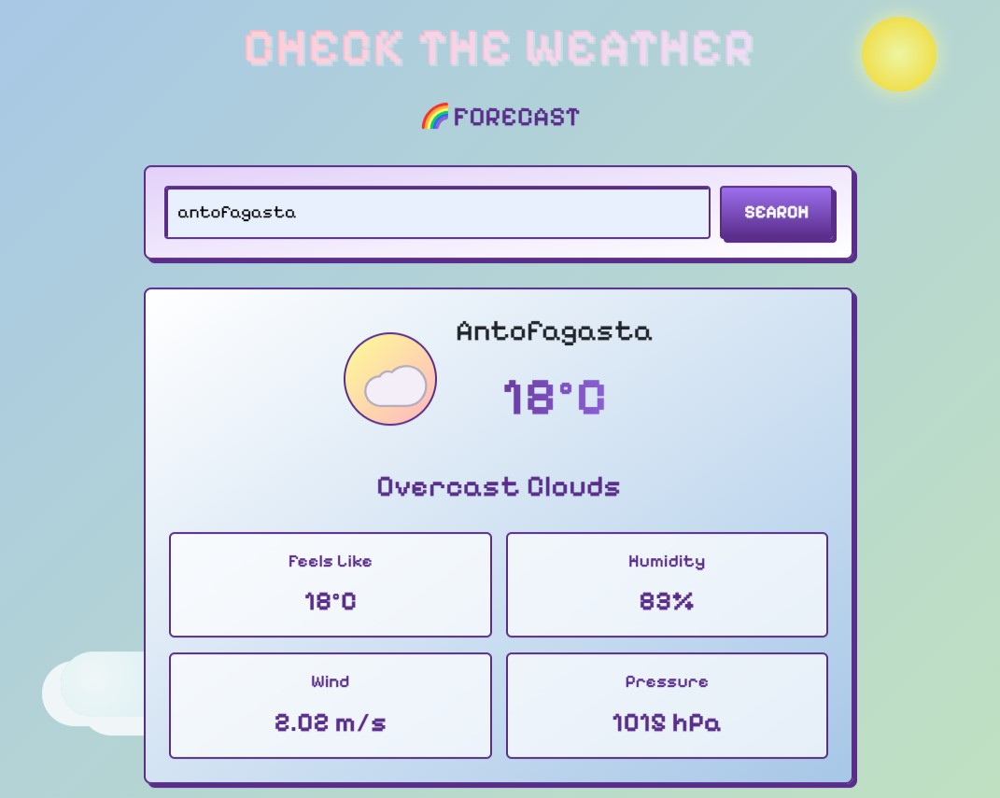

# ⛅ WeatherInfo App



**WeatherApp** es una aplicación React diseñada con inspiración en pixel art para consumir datos de una API de clima en tiempo real. Esta versión contiene todos los errores corregidos que se presentaron como tarea.

## Objetivo

El objetivo de este proyecto es aprender a consumir APIs, manejar estado y efectos en React, optimizar el rendimiento, gestionar errores y aplicar buenas prácticas en el desarrollo de aplicaciones Cliente/Servidor.

## Características Principales

1. **Búsqueda de Clima por Ciudad**:

   - Los usuarios pueden buscar el clima actual escribiendo el nombre de cualquier ciudad.
   - Muestra datos como:
     - Temperatura actual, mínima y máxima.
     - Sensación térmica.
     - Humedad.
     - Velocidad y dirección del viento.
     - Descripción del clima (despejado, nublado, lluvia, etc.).
     - Hora del amanecer y atardecer.

2. ## 🌐 API utilizada
[](https://openweathermap.org/api)

3. ## 🔍 Problemas resueltos
- ✅ Corrección de imports mal nombrados
- ✅ Implementación de loading states
- ✅ Validación de inputs
- ✅ Manejo de errores de API

4. **Diseño Responsivo**:
   - Uso de **Bootstrap** para una experiencia de usuario adaptativa.

## Estructura del Proyecto

```plaintext
WeatherApp/
├── public/                     # Archivos públicos
├── src/                        # Código fuente
│   ├── components/             # Componentes reutilizables
│   │   ├── WeatherForm.jsx     # Formulario para buscar el clima
│   │   ├── WeatherInfo.jsx     # Mostrar la información del clima 
│   │   ├── ErrorAlert.jsx      # Componente para mostrar errores
│   │   ├── Spinner.jsx         # Componente para mostrar proceso de carga
│   ├── hooks/                  # Hooks personalizados
│   │   ├── weatherApiHook.js   # Hook para consumir la API del clima (nombre erróneo)
│   ├── styles.css              # Estilos globales
│   ├── application.jsx         # Componente principal (nombre erróneo)
│   ├── main.jsx                # Punto de entrada de ReactDOM
├── .env                        # Variables de entorno para la API Key
├── package.json                # Configuración del proyecto y dependencias
├── vite.config.js              # Configuración de Vite
├── README.md                   # Documentación del proyecto
```
## Cómo Ejecutar el Proyecto

### Prerrequisitos

Antes de ejecutar el proyecto, asegúrate de tener instalado lo siguiente:

- [Node.js](https://nodejs.org/) (v16 o superior).
- [npm](https://www.npmjs.com/).

### Pasos para Configuración

1. **Clonar el repositorio**:

   ```bash
   git clone https://github.com/adalid-cl/ESPECIALIZACION_FRONTEND_M5_AE4.git
   cd ESPECIALIZACION_FRONTEND_M5_AE4
   ```

2. **Instalar las dependencias**:

   ```bash
   npm install
   ```

3. **Configurar la API Key**:

   - Regístrate en [OpenWeatherMap](https://openweathermap.org/) y obtén tu API Key.
   - Crea un archivo `.env` en la raíz del proyecto con el siguiente contenido:
     ```plaintext
     VITE_WEATHER_API_KEY=tu_api_key_aqui
     ```

4. **Ejecutar el servidor de desarrollo**:
   ```bash
   npm run dev
   ```
   La aplicación estará disponible en `http://localhost:5173`.


## Notas de Seguridad

- Asegúrate de no exponer la clave de API en el código fuente. Utiliza variables de entorno para mantenerla segura.
- Las validaciones deben realizarse tanto en el cliente como en el servidor en entornos reales.

## Autores

- [Brayan Diaz C](https://github.com/brayandiazc)
- [Alejandra Beltran](https://github.com/LeenahJz)

